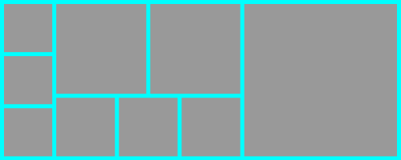

[image compositor](//cindylinz.github.io/Web-ImageCompositor)

This is a image compositor with simple user interface.
You set *width*, *border*, *gap*, and *background* color.
And set *layout* by a expression.

  + `3` means 3 images horizontally.
  + `[3]` means 3 images vertically.
  + `[3, 5]` means split the image into 2 part horizontally. The left part has 3 images vertically, and the right part has 5 images vertically.
  + `[3, [2, 3], 1]` is a complex case like this.

    

Then add images.
The compositior will composite these images into the final image that aligns them and preserves their ratio.

拼貼圖片的工具很多，可能就是太多了，所以我一直找不到我想要的「簡單的拼貼工具」：可以把我選入的圖片自動對齊、並且自動等比縮放不要裁切掉圖片的任何部分。

一直找不到，那就自己做一個以後就不用找了，這功能這麼單純想來應該很好做。原本以為可以 bottom-up 一路決定每一塊的大小，沒想到一旦想加入 gap 的設定之後，我就想不到解聯立方程式以外的方法了。而且解這個方程式如果用高斯消去法，還很容易精確度爆炸解不出答案，只好順便練習寫一次 Householder QR decomposition…
